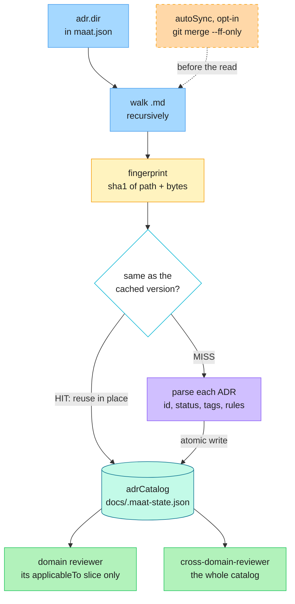
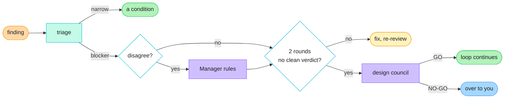

# Architecture

This is the deep dive behind the [README](README.md)'s "How it works" and "When a review stalls" sections: the exact mechanics of the ADR cache, the receipt checks, the design council, and the dashboard. Read the README first for the overview; come here when you want to know precisely how something behaves.

## Contents

- [ADR caching](#adr-caching--reviewers-share-one-read)
- [Receipts, not re-reads](#receipts-not-re-reads)
- [The audit](#an-audit-that-is-discipline-not-paperwork)
- [When a review stalls](#when-a-review-stalls)
- [The dashboard](#the-dashboard)
- [The run log](#the-run-log)
- [The five scripts](#the-five-scripts)

---

## ADR caching — reviewers share one read

Architecture Decision Records are usually too expensive to actually consult: re-reading every ADR body on every review burns the context you needed for the code. Maat keeps a **compressed, lossless catalog** instead. Per ADR it stores `id`, `title`, `status`, `path`, the `applicableTo` domain tags and the **verbatim** MUST/SHOULD rules. The prose (Context, Consequences, Alternatives) stays in the file, and `path` points back to it, so nothing a reviewer must obey is ever summarized away.



It parses both YAML frontmatter (`applicableTo`, `constraints`) and plain MADR markdown (a `**Tags:**` line plus a `## Rules for agents` bullet list), so it works against an existing ADR repo without reformatting it.

**ADRs can live in two places, and the difference matters when you amend one.** `adr.dir` defaults to `["adr", "docs/adr"]`, so both are read and merged into one catalog:

- **`adr/`, a git submodule** — your organization's centralized ADR repo, shared across projects. Amending one is a proposal to your organization: `/maat:adr-amend` opens a branch and PR in that repo, and the PR is the log of the change.
- **`docs/adr/`, in this repo** — ADRs this project owns. Amending one is an ordinary change: the ADR is edited in place on the current branch and rides the story's own PR, so the reviewer sees the ADR change beside the code that justifies it. `docs/decisions.md` is the log.

Either way `/maat:adr-amend` finds the file first and works out which it is, rather than assuming. An org-tier ADR whose submodule has no remote stops with an error instead of being edited locally, because that would fork a shared decision without anyone seeing it.

| Command | Does | Writes? |
|---|---|---|
| `node docs/adr-cache.mjs` | Status line plus a machine tag: `CACHE=HIT` / `MISS` / `NONE` | no |
| `node docs/adr-cache.mjs --ensure` | Rebuild **only if** stale or absent, then report | only when stale |
| `node docs/adr-cache.mjs --build` | Force a rebuild now | yes |
| `node docs/adr-cache.mjs --fingerprint` | Print the current fingerprint, nothing else | no |

**Invalidation is a fingerprint, not a timestamp.** The catalog is keyed by a SHA-1 over every ADR file's path and bytes, sorted; any add, edit or delete flips it to MISS on the next run. There is no staleness window to tune and no clock to get wrong.

**`--ensure` is what makes the fan-out cheap.** It is idempotent and safe to call from any agent or command: it checks first and writes only when a rebuild is actually needed. The Manager runs it once before spawning parallel reviewers so they all HIT instead of each rebuilding, and the plugin's single `SessionStart` hook runs it best-effort so a session's first review is already warm. Catalog writes go through a temp file and a rename, so concurrent agents cannot tear it.

**Per-root coverage is visible.** `adr.dir` may be an array, and every status line reports a count per root: `[adr/infra:12, adr/app:0]` tells you the second domain folder is empty or misnamed instead of hiding it inside one merged total.

**`autoSync` is off by default and fast-forward only.** When you turn it on, `--ensure` and `--build` run `git merge --ff-only` on the submodule holding your ADRs before fingerprinting, so newly published ADRs are picked up without updating the plugin. A branch that has diverged (unpushed local ADR commits) makes `--ff-only` fail; that is caught, reported, and the on-disk ADRs are used. It never rewrites history, and it is skipped entirely when `$CI` is set so headless runs review the pinned submodule SHA.

**The savings figure is an estimate and says so.** Each HIT line reports roughly 500 tokens saved per reused ADR body, minus about 200 to read the catalog. It is a ballpark for the session handoff, not a bill, and if nothing was reused, agents are told to say so rather than invent a number.

Every agent surfaces its own `ADR cache …` line, so you can see what was reused on each pass rather than taking it on trust.

---

## Receipts, not re-reads

Every specialist persists a dated report to `docs/reviews/` and closes with a structured `RECEIPT:` block. The Manager works from the receipt instead of reopening the file, and reopens the moment anything is off. On CRITICAL tier every report is read in full regardless.

**Deciding "off" is arithmetic, so a script does it.** `docs/receipt-check.mjs` reads what is already on disk:

```text
receipt-check: 4 report(s) — 1 OK, 2 REOPEN, 1 UNREAD
  OK      auth-code-2026-08-30.md            SHIP
  REOPEN  auth-infra-security-2026-08-30.md  APPROVE
          → checksum: counts say issues=1 suspicions=0 clean=0, but 2/0/0 lines are listed
          → clean verdict "APPROVE" with 2 [ISSUE] line(s)
          → checks=n/a while carrying a blocking finding — nothing was run
          → [HIGH] present with no `Exposure: … basis:` line anywhere in the report
  UNREAD  auth-network-2026-08-30.md         -
          → no RECEIPT block in the persisted report
```

| It checks | Examples |
|---|---|
| **Two checksums** | `counts` against the listed findings; the `evidence:` tally against the per-finding tags |
| **The verdict** | Is it this agent's clean value? Does it contradict its own findings? |
| **The evidence** | A finding with no tier tag; a HIGH tagged `derived`, which rule 19 caps at MED |
| **What ran** | Failed or skipped checks, or `checks=n/a`, under a blocking finding |
| **The paper trail** | A missing `REVIEW_LOG.md` row, a missing bug Issue, a `HEAD:` that predates the commit in hand, an outstanding human ruling |

**Four things it will not touch,** printed at the bottom of every run so they cannot be automated away: a terse line that reads worse than its own severity tag, whether a claimed ADR violation is real, whether zero findings is honest for the size of the diff, and whether a HIGH's stated exposure holds up. Those are judgement, and they stay with the Manager.

**Evidence is checked per finding, not in aggregate.** Rule 19 always required every finding to declare `demonstrated`, `code-traced` or `derived`, and caps `derived` at MED. An aggregate tally cannot say *which* finding was derived, so the tier now rides on the finding line and the tally became a checksum over those tags:

```text
1. [ISSUE][HIGH][code-traced] api/handler.ts:88 — unbounded page size
2. [CLEAN][demonstrated] api/auth.ts — token refresh verified end to end
counts (a CHECKSUM): issues=1 suspicions=0 clean=1
evidence (a CHECKSUM over the tags above): demonstrated=1 code-traced=1 derived=0
```

Two independent counts that have to agree, and a rule whose arithmetic is now checkable exactly.

**It advises; it never decides.** It exits 0 on every path including its own failure, `OK` means the mechanics passed rather than that the report is right, and anything it could not check prints with a `?` so unchecked never reads as clean.

---

## An audit that is discipline, not paperwork

The audit stage does not check that a review *happened*. It checks whether the report exists, the receipt matches the report body, the checks really ran, findings and verdicts line up, and bug issues were filed when required. If a receipt claims more than the evidence supports, that is the finding.

### State that survives the session

`docs/STATE.md` is the resume point the next session reads first, `docs/.maat-state.json` holds the ratified tier and ADR catalog, and `docs/reviews/` is the dated evidence trail. Work does not become "whatever the current chat remembers".

### The session hook

The plugin's entire hook surface is a single `SessionStart` entry:

| Hook | Trigger | What it does | Turning it off |
|---|---|---|---|
| Session brief | `SessionStart` | Runs `docs/session-brief.mjs` best-effort: warms the ADR cache so the first review is a HIT instead of a cold MISS, then prints one line of resume context | Disable the plugin. In a project it is already a no-op when the script is absent. |

The brief is one line, on purpose:

```text
📋 maat: scope=auth-rotation · tier=CRITICAL · rounds=1 · reviews 2 at HEAD, 1 stale · 1 decision(s) due to archive
⚠️  maat: a human ruling is outstanding — do not resume a graded verdict past it
```

Every fact in it otherwise costs a resuming session several tool calls and a few thousand tokens of file content to rediscover. It reads, it prints, it never writes. Projects initialized before this script existed fall back to the old ADR-cache-only behavior automatically.

The whole thing is wrapped in a try/catch and cannot fail a session. Nothing else in this plugin registers a hook, and nothing here intercepts a tool call.

---

## When a review stalls

The nine stages in the README are the happy path. Most of the interesting behavior is what happens when a reviewer says no, and it is deliberately not "ask the human" at the first sign of trouble.



**Filter 1, evidence.** Only `demonstrated` (something ran and failed, raw output pasted) or `code-traced` (`path:line` in shipped code) can block. A finding reasoned from a document caps at MED and becomes a named failing test. A reviewer whose receipt says `checks=n/a` cannot block at all.

**Filter 2, blast radius.** Every HIGH carries `Exposure: ~N% of <users|requests|runs>, basis: measured|counted-in-code|assumption`. Findings rank by exposure × irreversibility × silence, not by how alarming they sound.

**Filter 3, triage.** Security, data-integrity, legal and safety go straight to you, always. Everything else: an `assumption` basis escalates to the **`impact-analyst`**, which counts the real affected surface mechanically and pastes the command rather than sending it back to the reviewer that guessed, and the finding stays blocking meanwhile. Under 3% with a real basis becomes a condition on the ship; at or above 3% it is confirmed as a blocker.

**The `impact-analyst` also prices fixes.** Given candidate fixes, it classifies each as CONTAINS (removes the defect class), RELOCATES (moves it somewhere else, and says where) or WIDENS (creates surface the old defect did not have). That verdict is one of the four GO conditions at the council.

**The council convenes once, and its verdict is arithmetic.** Two graded design-challenger verdicts without a go, or two consecutive REWORK verdicts on the same target, or a fix that reverses something an earlier round proved, and `/maat:council` seats `design-challenger`, `architecture-reviewer` and `impact-analyst` in parallel on the same packet. GO requires all four: no open blocking HIGH, an architect APPROVE on a path, an impact-analyst verdict on that path that is not WIDENS, and the gating verification run or scheduled as build task 1. On GO the loop continues and nobody wakes you. On NO-GO, or a second stall on the same shape, it hard-stops and you get a Path-Forward Brief: business impact first, one-sentence root cause, options with cost and risk, the recommendation, and any dissent verbatim.

**When the loop stops with nothing genuinely blocking**, the default recommendation is "build now: every open finding becomes a day-1 failing test." Another design round is the explicit override, never the default.

A downgraded finding is still reported, with its exposure figure and the reasoning. Triage decides whether something blocks; it never decides whether you see it.

---

## The dashboard

`/maat:init` copies `dashboard.mjs` into your project. It renders one self-contained HTML file with no CDN, no web fonts and no external calls, so nothing about your project leaves the machine:

```bash
node docs/dashboard.mjs                    # writes docs/dashboard.html
node docs/dashboard.mjs --out /tmp/x.html
```

| Panel | Answers | Read from |
|---|---|---|
| **Feature progress** | How far is each feature, and where are the bugs concentrated? | Issues rolled up by feature label, closed vs open |
| **Agent performance** | Volume *and* quality, per agent | The `RECEIPT:` block in every `docs/reviews/*.md` |
| **Audit highlights** | Who is improving or degrading, and this month's one process finding | The latest `docs/reviews/meta-audit-*.md` |
| **Manager decisions** | Tiers ratified, receipts reopened, findings triaged down, councils and their verdicts | `docs/run-log.jsonl` |
| Verdict mix, rounds per story, recent reviews, Issues and Milestones | The shape of the work | `docs/REVIEW_LOG.md` plus live `gh` queries |

**Volume is easy; quality is the point.** Per agent you get reports, findings and an H/M/L split, then the columns that actually matter: **clean-run rate** (a reviewer that is never clean is manufacturing findings, and rule 4 says a verified clean pass is the goal), **executed%** (the share of findings backed by `demonstrated` or `code-traced` evidence rather than reasoned from a document, since only those two can gate a change), and **ADR hit rate**. Flags call out exactly the patterns the monthly audit is told to hunt: a report with no receipt at all, a run where the agent executed nothing, a majority-`derived` evidence mix, a receipt the Manager had to reopen, and a HIGH that got triaged down as over-called.

None of it grades anyone. It surfaces the candidate and a human decides, the same division of labor `/maat:audit` already uses.

---

## The run log

Most of the dashboard needed no new logging: the receipts were already on disk and nothing was reading them. One thing genuinely was not recorded anywhere mechanical, and that is **the Manager's own judgement**. Which receipts did not hold up. Which HIGH was triaged down, and on what verified exposure. Which tier was ratified against what was proposed. How a deadlock or a council resolved. All of it lived only in prose.

`docs/run-log.jsonl` is that gap, and nothing more:

```bash
node docs/run-log.mjs --summary                    # aggregate counts
node docs/run-log.mjs --summary --since 2026-08-01
node docs/run-log.mjs --json                       # same, machine-readable
```

- **Append-only JSON Lines**, one object per line, never rewritten. Parallel agents append concurrently, and a single-line append has none of the read-modify-write races a JSON array or a markdown table would. It matches rule 11: records are immutable, corrections are appended.
- **A pointer, not a copy.** IDs, paths, enums and numbers, with a length cap. Never a finding's prose; the report is linked instead.
- **Committed**, like `REVIEW_LOG.md` and `docs/reviews/`, because it is part of the audit trail. Only the generated `dashboard.html` is gitignored.
- **Telemetry, not a gate.** Nothing reads it to block, refuse or unlock anything, and nothing should. The event vocabulary is closed so the numbers stay aggregatable, an unknown event is refused rather than silently recorded, and every failure path exits 0 so a logging problem can never take down a real run.

`/maat:audit` opens with these numbers and uses them to choose what to sample, instead of picking six reports at random.

---

## The five scripts

All plain Node, read-only or append-only, and exit 0 on every path including their own failure. None of them gates anything.

| Script | Run it when | What it does |
|---|---|---|
| [`adr-cache.mjs`](#adr-caching--reviewers-share-one-read) | Agents run it every pass | Builds and reuses the compressed ADR catalog |
| [`receipt-check.mjs`](#receipts-not-re-reads) | Before trusting a review | Prints `OK` / `REOPEN` / `UNREAD` per report |
| [`session-brief.mjs`](#the-session-hook) | The `SessionStart` hook | Warms the cache, prints one line of resume context |
| [`dashboard.mjs`](#the-dashboard) | Whenever you want the picture | Renders a local, offline HTML dashboard |
| [`run-log.mjs`](#the-run-log) | The Manager, at each judgement | Appends one line to `docs/run-log.jsonl` |
