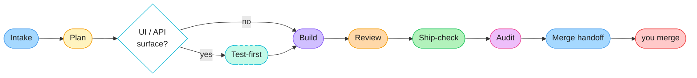
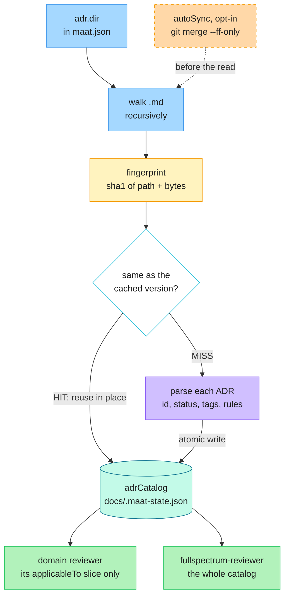

<div align="center">

# Maat

**An agentic software-engineering team for Claude Code and GitHub Copilot.**

Plans, tests, builds, reviews, debugs and prepares your change for merge — routing each change to the minimum correct reviewer set instead of treating everything the same way.

[](LICENSE)
[](CHANGELOG.md)
[](https://docs.claude.com/en/docs/claude-code)
[](https://github.com/features/copilot)
[](https://nodejs.org)

[Quick start](#quick-start) · [The loop](#the-loop) · [ADR caching](#adr-caching--reviewers-share-one-read) · [Commands](#commands) · [Agents](#agents) · [Configuration](#configuration) · [Contributing](#contributing)

</div>

---

## What it is

Install one plugin, run one command, and a Manager agent conducts a full delivery loop for you — from a half-formed story to a change that is ready for you to merge.

```text
/maat:ship 'add rate limiting to the login endpoint'
```

Maat is **a team, not a gate**. Nothing here intercepts or blocks a tool call. What it gives you is structure: a story that gets refined before it gets planned, a plan you approve before anything is built, tests written before the code when a contract is at stake, review by the specialists the change actually warrants, and an honest audit that checks the agents did the work they claim.

**Why "not a gate" matters:** if you need merges or `terraform apply` to be genuinely impossible for an agent, that has to hold where it can actually hold — credential separation, branch protection, a required CI check. Maat says so plainly rather than implying a guarantee it cannot make. See [Non-goals](#non-goals).

---

## Quick start

**1. Install the plugin**

<table>
<tr><th>Claude Code</th><th>GitHub Copilot</th></tr>
<tr><td>

```text
/plugin marketplace add https://github.com/mohannadrabie/maat.git
/plugin install maat@maat
```

</td><td>

```text
copilot plugin marketplace add https://github.com/mohannadrabie/maat.git
copilot plugin install maat@maat
```

</td></tr>
</table>

Both clients expose the same `/maat:` namespace.

> [!NOTE]
> Copying files into a local plugin folder does **not** register the plugin. Install it through the client's plugin system.

**2. Scaffold your repo**

```text
/maat:init
```

Interactive. Creates the project docs and helper scripts, never overwriting a file you own. Re-run any time to verify setup; `/maat:init --update` refreshes plugin-managed files after a plugin upgrade.

**3. Ship something**

```text
/maat:ship 'add rate limiting to the login endpoint'
```

Prefer to drive it yourself? Run the stages one at a time:

```text
/maat:story 'add S3 bucket with encryption'
/maat:review
/maat:ship-check
```

---

## The loop

The Manager (**Alakazam**) is the single voice to you. It delegates to specialists, carries results forward, and stops at every point where a human decision is needed.



<sub>Dashed = conditional. You decide at three points: **Plan** (approve it), **Review** (a REWORK or BLOCKER stops the loop), and the **merge** itself — which is always yours.</sub>

| Stage | What happens | Where it stops for you |
|---|---|---|
| **Intake** | `intake-refiner` extracts real requirements without inventing any | A story too vague to plan comes back as questions, not guesses |
| **Plan** | `story-implementer` (Phase 1) plans and proposes a risk tier the Manager ratifies | You approve the plan before anything is built |
| **Test-first** | `test-writer` writes black-box acceptance tests and confirms them red | Conditional — runs only when the plan introduces a new or changed UI/API surface |
| **Build** | `story-implementer` (Phase 2) implements against those failing tests | — |
| **Review** | The tier's reviewers run in parallel and persist dated reports | REWORK, a BLOCKER or an ADR violation stops the loop with its named unlock |
| **Ship-check** | Real checks, ADR compliance, fresh reports read in full, clean tree | SHIPPABLE or NOT SHIPPABLE, with the exact unlock per blocker |
| **Audit** | Verifies every agent actually did the work its receipt claims | A shirked step is a blocker, named in the summary |
| **Merge handoff** | Manager Summary + session handoff + a commit | **You** merge. Always. |

### Ceremony scales with risk

Who reviews is decided by the risk tier, ratified by the Manager — you can challenge over- or under-tiering.

| Tier | Reviewers | Typical change |
|---|---|---|
| 🟢 **TRIVIAL** | tests + self-review | Docs, comments, formatting |
| 🟡 **STANDARD** | 1 domain reviewer + `fullspectrum-reviewer` | Most feature work, refactors, config |
| 🔴 **CRITICAL** | `redteam` + the right domain reviewer(s) + `fullspectrum-reviewer` | Auth, payments, migrations, public API, IAM/network, prod-facing |

`fullspectrum-reviewer` joins every tier above TRIVIAL and does not count against the reviewer cap — it is the standing cross-domain pass that reads the **whole** ADR catalog and catches what falls in the seams between reviewer lanes.

---

## What makes it different

### ADR caching — reviewers share one read

Architecture Decision Records are usually too expensive to actually consult: re-reading every ADR body on every review burns the context you needed for the code. Maat keeps a **compressed, lossless catalog** instead. Per ADR it stores `id`, `title`, `status`, `path`, the `applicableTo` domain tags and the **verbatim** MUST/SHOULD rules. The prose — Context, Consequences, Alternatives — stays in the file and `path` points back to it, so nothing a reviewer must obey is ever summarised away.



It parses both YAML frontmatter (`applicableTo`, `constraints`) and plain MADR markdown (a `**Tags:**` line plus a `## Rules for agents` bullet list), so it works against an existing ADR repo without reformatting it.

| Command | Does | Writes? |
|---|---|---|
| `node docs/adr-cache.mjs` | Status line plus a machine tag: `CACHE=HIT` / `MISS` / `NONE` | no |
| `node docs/adr-cache.mjs --ensure` | Rebuild **only if** stale or absent, then report | only when stale |
| `node docs/adr-cache.mjs --build` | Force a rebuild now | yes |
| `node docs/adr-cache.mjs --fingerprint` | Print the current fingerprint, nothing else | no |

**Invalidation is a fingerprint, not a timestamp.** The catalog is keyed by a SHA-1 over every ADR file's path and bytes, sorted — any add, edit or delete flips it to MISS on the next run. There is no staleness window to tune and no clock to get wrong.

**`--ensure` is what makes the fan-out cheap.** It is idempotent and safe to call from any agent or command: it checks first and writes only when a rebuild is actually needed. The Manager runs it once before spawning parallel reviewers so they all HIT instead of each rebuilding, and the plugin's single `SessionStart` hook runs it best-effort so a session's first review is already warm. Catalog writes go through a temp file and a rename, so concurrent agents cannot tear it.

**Per-root coverage is visible.** `adr.dir` may be an array, and every status line reports a count per root — `[adr/infra:12, adr/app:0]` tells you the second domain folder is empty or misnamed instead of hiding it inside one merged total.

**`autoSync` is off by default and fast-forward only.** When you turn it on, `--ensure` and `--build` run `git merge --ff-only` on the submodule holding your ADRs before fingerprinting, so newly published ADRs are picked up without updating the plugin. A branch that has diverged (unpushed local ADR commits) makes `--ff-only` fail — that is caught, reported, and the on-disk ADRs are used. It never rewrites history, and it is skipped entirely when `$CI` is set so headless runs review the pinned submodule SHA.

**The savings figure is an estimate and says so.** Each HIT line reports roughly 500 tokens saved per reused ADR body, minus about 200 to read the catalog. It is a ballpark for the session handoff, not a bill — and if nothing was reused, agents are told to say so rather than invent a number.

Every agent surfaces its own `ADR cache …` line, so you can see what was reused on each pass rather than taking it on trust.

### Receipts, not re-reads

Every specialist persists a dated report to `docs/reviews/` and closes with a structured `RECEIPT:` block. The Manager carries the receipt forward instead of reopening the file — but reopens it the moment anything is off: a checksum that doesn't match its finding list, a clean verdict with a HIGH finding, a blocking finding backed by no evidence, a report with no `REVIEW_LOG.md` row. On CRITICAL tier every report is read in full regardless.

### An audit that is discipline, not paperwork

The audit stage does not check that a review *happened*. It checks whether the report exists, the receipt matches the report body, the checks really ran, findings and verdicts line up, and bug issues were filed when required. If a receipt claims more than the evidence supports, that is the finding.

### One package, two clients

Claude sources are authored once and the Copilot surfaces are generated from them, so there is no second workflow to keep in sync.

### State that survives the session

`docs/STATE.md` is the resume point the next session reads first, `docs/.maat-state.json` holds the ratified tier and ADR catalog, and `docs/reviews/` is the dated evidence trail. Work does not become "whatever the current chat remembers".

---

## Commands

### Primary workflow

| Command | Does |
|---|---|
| `/maat:ship <story \| requirements-doc \| ticket>` | Full Manager-orchestrated loop |
| `/maat:story <story \| requirements-doc \| project>` | Intake, planning and risk tiering only |
| `/maat:review [lane] [scope]` | Run the tier's reviewers (default: current diff vs `main`) |
| `/maat:ship-check [branch]` | Pre-merge verification (default: current branch) |

### Investigation and escalation

| Command | Does |
|---|---|
| `/maat:debug <failure \| error output \| path>` | Reproduce, isolate, minimal fix — never guess-and-patch |
| `/maat:redteam <design \| module \| scope>` | Adversarial attack on a built change |
| `/maat:challenge <design \| ADR \| code path>` | Attack a design or ADR **before** it is built |
| `/maat:council [artifact]` | Design-council escalation when a pre-build loop stalls |
| `/maat:manager [dispute context]` | Break a reviewer deadlock |
| `/maat:audit-reviewers [sample \| since]` | Periodic reviewer and manager quality audit (default: last month) |

### Maintenance

| Command | Does |
|---|---|
| `/maat:adr-amend <ADR-ID> <reason>` | Propose an ADR amendment |
| `/maat:init` | Scaffold or verify this project (`--update` to refresh) |
| `/maat:help` | Command menu and setup status |

Each command is also generated as a **skill**, so the same capability is reachable in GitHub Copilot as well as Claude Code. Run `/maat:help` for the menu plus this project's setup status.

---

## Agents

19 specialists. The point is not "more agents" — it is that the loop can route a change to the *minimum correct* reviewer set.

<table>
<tr><th align="left">Core</th><th align="left">Cross-cutting review</th></tr>
<tr valign="top"><td>

| Agent | Role |
|---|---|
| `manager` | Conducts the loop, single voice to you |
| `intake-refiner` | Extracts requirements, never invents them |
| `story-implementer` | Decomposes, plans, builds |
| `test-writer` | Black-box acceptance tests, written red first |
| `debugger` | Reproduce, isolate, minimal fix |
| `analyst` | Structural findings and path options |
| `adr-amender` | Proposes ADR changes |

</td><td>

| Agent | Role |
|---|---|
| `code-reviewer` | Correctness, tests, maintainability |
| `architecture-reviewer` | Design, coupling, cost, evolution |
| `fullspectrum-reviewer` | Whole-catalog cross-domain seam pass |
| `redteam` | Failure scenarios, mandates proof-tests |
| `challenger` | Attacks a design before it is built |

</td></tr>
<tr><th align="left">Infrastructure</th><th align="left">Application</th></tr>
<tr valign="top"><td>

| Agent | Role |
|---|---|
| `network-reviewer` | Topology, segmentation, exposure |
| `security-reviewer` | IAM, secrets, encryption, supply chain |
| `consumer-reviewer` | Usability and decision quality |

</td><td>

| Agent | Role |
|---|---|
| `appsec-reviewer` | Authn/authz, injection, deps, secrets |
| `api-reviewer` | Contracts, versioning, breaking changes |
| `data-reviewer` | Schema, migration safety, integrity |
| `performance-reviewer` | Budgets, complexity, caching, concurrency |

</td></tr>
</table>

---

## What `/maat:init` adds

```text
your-project/
├── maat.json                    # ADR locations + sync behavior (you own this)
├── CLAUDE.md                    # your operating context, risk tiers, hard rules
├── docs/
│   ├── PRINCIPLES.md            # the working charter — anti-kafka rules
│   ├── STATE.md                 # the resume point, read first every session
│   ├── decisions.md             # active decision log
│   ├── decisions-archive.md     # swept automatically at session handoff
│   ├── backlog.md               # or a GitHub Project, if you bootstrap one
│   ├── REVIEW_LOG.md            # append-only review ledger
│   ├── adr-template.md
│   ├── issue-template.md        # portable Issue schema + gh query cookbook
│   ├── manager-summary-format.md
│   ├── adr-cache.mjs            # the ADR token-cache
│   ├── decisions-archive.mjs    # atomic decision-log sweeper
│   ├── dashboard.mjs            # local insights dashboard
│   ├── .maat-state.json         # tier, ADR catalog, loop state
│   └── reviews/                 # dated review evidence
└── adr/  or  docs/adr/
```

`/maat:init` also bootstraps a GitHub Project board and label taxonomy when `gh` is installed with the `repo` and `project` scopes, and can migrate an existing `docs/backlog.md` into Issues — resume-safe, idempotent, and never without asking first.

---

## Configuration

Everything lives in `maat.json` at your repo root:

```json
{
  "adr": {
    "dir": ["adr/infra", "adr/app"],
    "autoSync": false,
    "upstreamBranch": "main"
  }
}
```

| Key | Default | Purpose |
|---|---|---|
| `adr.dir` | `["adr", "docs/adr"]` | One path or an array. Use an array for per-domain ADR folders so each root is covered visibly — the cache reports a per-root count, and a `…:0` tells you a folder is empty or misnamed. |
| `adr.autoSync` | `false` | Fast-forward the ADR submodule (`git merge --ff-only`) before each build so newly published ADRs land without updating the plugin. Fails soft, skipped when `$CI` is set. Off by default because an auto-advance dirties the working tree. |
| `adr.upstreamBranch` | `"main"` | The branch `autoSync` fast-forwards to. |

---

## Viewing insights

`/maat:init` copies `dashboard.mjs` into your project. It renders a local HTML view of review verdicts and findings from `docs/REVIEW_LOG.md` plus live `gh` data:

```bash
node docs/dashboard.mjs
```

`docs/dashboard.html` is generated, local-only and never hosted — keep it gitignored, which `/maat:init` sets up for you.

---

## Agent teams (experimental, opt-in)

Off by default. Enabling it adds `/maat:review --team <scope>` for CRITICAL-tier work, running reviewers as parallel teammates with disjoint scopes.

```json
{
  "env": { "CLAUDE_CODE_EXPERIMENTAL_AGENT_TEAMS": "1" },
  "teammateMode": "in-process"
}
```

Copy that into **your** settings (`~/.claude/settings.json` or the project's `.claude/settings.json`) and restart — a plugin's own `settings.json` is not auto-loaded. A ready-to-copy example lives at [settings.json](settings.json). `in-process` means no split panes and no session resume unless you are in tmux or iTerm2.

---

## Non-goals

Maat carries the **loop**. It is deliberately not an enforcement layer:

- **No tool-call gating.** The entire hook surface is one best-effort `SessionStart` ADR-cache warm-up. There is no pre-tool-use guard, no protected-path check, no report or team gate.
- **Human-only actions are a discipline, not a boundary.** `git merge`, `gh pr merge`, pushing the default branch, `terraform apply` and prod deploys stay with you because the agents are told to leave them alone — not because something stops them. Where that needs to be genuinely enforceable, enforce it with credential separation, branch protection and a required CI check.
- **Review reports are evidence, not keys.** A dated report is what the Manager and the next reviewer work from. It does not unlock a path, because no path is locked.

---

## Requirements

- Claude Code or GitHub Copilot with plugin support
- Node.js ≥ 20
- `gh` — for the GitHub Project and Issues flows
- `jq` — for the ADR amendment helpers

---

## Contributing

The repository **is** the plugin. Some of it is authored; some is generated.

| Path | Status |
|---|---|
| `.claude-plugin/plugin.json`, `.claude-plugin/marketplace.json` | authored |
| `agents/*.md` | authored — Claude agent definitions |
| `commands/*.md` | authored — slash commands |
| `hooks/hooks.json` | authored — hook manifest |
| `scripts/*.mjs` | authored — helpers `/maat:init` copies into a project |
| `templates/*` | authored — docs `/maat:init` scaffolds into a project |
| `copilot-agents/*.agent.md` | **generated** from `agents/` |
| `skills/*/SKILL.md` | **generated** from `commands/` |
| `plugin.json`, `hooks.json` (root) | **generated** from their `.claude-plugin/` and `hooks/` sources |

> [!IMPORTANT]
> Never hand-edit a generated file — the next sync overwrites it. Edit the source, then regenerate.

```bash
node scripts/sync-copilot-format.mjs          # regenerate the derived surfaces
node scripts/sync-copilot-format.mjs --check  # verify no drift (CI runs this)
node scripts/validate-plugin.mjs              # manifests, frontmatter, orphans
```

CI runs all three on every push and pull request, so a change that edits a source without regenerating fails before it ships a plugin whose two clients disagree.

---

## Troubleshooting

<details>
<summary><b><code>/maat:*</code> commands do not appear</b></summary>

Run `/plugin list` (or `copilot plugin list`). If `maat` is missing, install it again. If it is listed but the commands are not showing, restart the client so the plugin menu refreshes.
</details>

<details>
<summary><b>ADRs are not being reused</b></summary>

```bash
node docs/adr-cache.mjs          # what state is the cache in?
node docs/adr-cache.mjs --build  # force a rebuild
```

`CACHE=NONE` means no ADRs were found — check `adr.dir` in `maat.json` points at the right folder(s). A per-root count of `…:0` means that specific folder is empty or misnamed.
</details>

<details>
<summary><b>Re-check or repair setup</b></summary>

```text
/maat:init            # verify, and scaffold anything missing
/maat:init --update   # refresh plugin-managed files after a plugin upgrade
```

`--update` backs up any file it would overwrite to `<file>.bak` first, and never touches files you own.
</details>

<details>
<summary><b>The GitHub board bootstrap was skipped</b></summary>

It needs `gh` on PATH with both the `repo` and `project` scopes:

```bash
gh auth refresh -s project
```

Then re-run `/maat:init`. Nothing else in an init run depends on it.
</details>

---

## License

[MIT](LICENSE) © Mohannad Rabie
