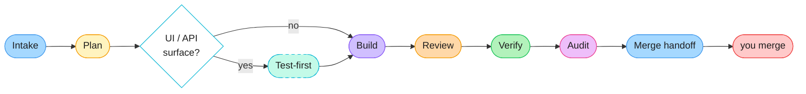
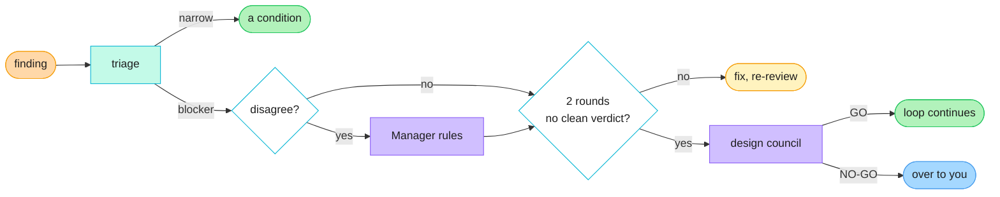
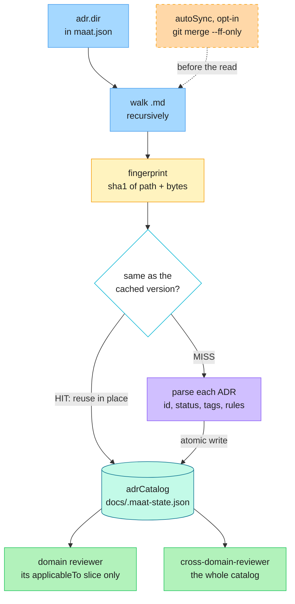

<div align="center">

# Maat

**An agentic software-engineering team for Claude Code and GitHub Copilot.**

Plans, tests, builds, reviews, debugs and prepares your change for merge — routing each change to the minimum correct reviewer set instead of treating everything the same way.

[](LICENSE)
[](CHANGELOG.md)
[](https://docs.claude.com/en/docs/claude-code)
[](https://github.com/features/copilot)
[](https://nodejs.org)

[Quick start](#quick-start) · [The loop](#the-loop) · [Commands](#commands) · [Agents](#agents) · [How it works](#how-it-works) · [What `/maat:init` adds](#what-maatinit-adds) · [Configuration](#configuration) · [Non-goals](#non-goals) · [Contributing](#contributing)

</div>

---

## What it is

Install one plugin, run one command, and a Manager agent conducts a full delivery loop for you — from a half-formed story to a change that is ready for you to merge.

```text
/maat:ship 'add rate limiting to the login endpoint'
```

Maat is **a team, not a gate**. Nothing here intercepts or blocks a tool call. What it gives you is structure: a story that gets refined before it gets planned, a plan you approve before anything is built, tests written before the code when a contract is at stake, review by the specialists the change actually warrants, and an honest audit that checks the agents did the work they claim.

**Why "not a gate" matters:** if you need merges or `terraform apply` to be genuinely impossible for an agent, that has to hold where it can actually hold — credential separation, branch protection, a required CI check. Maat says so plainly rather than implying a guarantee it cannot make. See [Non-goals](#non-goals).

---

## Quick start

**1. Install the plugin**

<table>
<tr><th>Claude Code</th><th>GitHub Copilot</th></tr>
<tr><td>

```text
/plugin marketplace add https://github.com/mohannadrabie/maat.git
/plugin install maat@maat
```

</td><td>

```text
copilot plugin marketplace add https://github.com/mohannadrabie/maat.git
copilot plugin install maat@maat
```

</td></tr>
</table>

Both clients expose the same `/maat:` namespace.

> [!NOTE]
> Copying files into a local plugin folder does **not** register the plugin. Install it through the client's plugin system.

**2. Scaffold your repo**

```text
/maat:init
```

Interactive. Creates the project docs and helper scripts, never overwriting a file you own. Re-run any time to verify setup; `/maat:init --update` refreshes plugin-managed files after a plugin upgrade.

**3. Ship something**

```text
/maat:ship 'add rate limiting to the login endpoint'
```

Prefer to drive it yourself? Run the stages one at a time:

```text
/maat:plan 'add S3 bucket with encryption'
/maat:review
/maat:verify
```

---

## The loop

The Manager (**Osiris**) is the single voice to you. It delegates to specialists, carries results forward, and stops at every point where a human decision is needed.



<sub>Dashed = conditional. You decide at three points: **Plan** (approve it), **Review** (a REWORK or BLOCKER stops the loop), and the **merge** itself, which is always yours. The diagram is the shape; the table below is the complete stage list.</sub>

| Stage | What happens | Where it stops for you |
|---|---|---|
| **Intake** | `intake-refiner` extracts real requirements without inventing any | A story too vague to plan comes back as questions, not guesses |
| **Plan** | `story-implementer` (Phase 1) plans and proposes a risk tier the Manager ratifies | You approve the plan before anything is built |
| **Test-first** | `test-writer` writes black-box acceptance tests and confirms them red | Conditional — runs only when the plan introduces a new or changed UI/API surface |
| **Build** | `story-implementer` (Phase 2) implements against those failing tests | — |
| **Review** | The tier's reviewers run in parallel and persist dated reports | REWORK, a BLOCKER or an ADR violation stops the loop with its named unlock. Narrow findings are triaged first, so not every HIGH stops you |
| **Verify** | Real checks, ADR compliance, fresh reports read in full, clean tree | SHIPPABLE or NOT SHIPPABLE, with the exact unlock per blocker |
| **Audit** | Verifies every agent actually did the work its receipt claims | A shirked step is a blocker, named in the summary |
| **Pre-merge read** | Every report the loop only trusted by its receipt gets one full read before anything is called shippable | A body-vs-receipt discrepancy is a blocker, not a nit |
| **Merge handoff** | Manager Summary + session handoff + a commit | **You** merge. Always. |

### Ceremony scales with risk

Who reviews is decided by the risk tier, ratified by the Manager — you can challenge over- or under-tiering.

| Tier | Reviewers | Typical change |
|---|---|---|
| 🟢 **TRIVIAL** | tests + self-review | Docs, comments, formatting |
| 🟡 **STANDARD** | 1 domain reviewer + `cross-domain-reviewer` | Most feature work, refactors, config |
| 🔴 **CRITICAL** | `red-team` + the right domain reviewer(s) + `cross-domain-reviewer` | Auth, payments, migrations, public API, IAM/network, prod-facing |

`cross-domain-reviewer` joins every tier above TRIVIAL and does not count against the reviewer cap — it is the standing cross-domain pass that reads the **whole** ADR catalog and catches what falls in the seams between reviewer lanes.

**Who decides the tier.** `story-implementer` proposes one in its plan with a one-line justification. **The Manager ratifies it**, challenging over- or under-tiering, and the tier is its call. It is persisted once to `docs/.maat-state.json`, and `/maat:review` and `/maat:verify` reuse it rather than re-deriving, so they cannot disagree with the plan. Reviewers calibrate to the tier; they do not re-litigate it. You can overrule it at any point.

**The tier table is yours to extend.** The definitions live in your project's `CLAUDE.md`, and you can add tiers, rename them, or name classes of change that always land in one. For a rule that binds rather than advises, write it as an **ADR**: an accepted ADR outranks `CLAUDE.md` (rule 9), so `MUST: any change under payments/ is CRITICAL` in an ADR's `Rules for agents` binds the Manager's ratification. A project rule may raise ceremony, never lower it, and security, data-integrity, legal and safety changes never drop out of review.

---

### When something goes wrong

The nine stages above are the happy path. Most of the interesting behaviour is what happens when a reviewer says no, and it is deliberately not "ask the human" at the first sign of trouble.



**Filter 1, evidence.** Only `demonstrated` (something ran and failed, raw output pasted) or `code-traced` (`path:line` in shipped code) can block. A finding reasoned from a document caps at MED and becomes a named failing test. A reviewer whose receipt says `checks=n/a` cannot block at all.

**Filter 2, blast radius.** Every HIGH carries `Exposure: ~N% of <users|requests|runs>, basis: measured|counted-in-code|assumption`. Findings rank by exposure × irreversibility × silence, not by how alarming they sound.

**Filter 3, triage.** Security, data-integrity, legal and safety go straight to you, always. Everything else: an `assumption` basis escalates to the **`impact-analyst`**, which counts the real affected surface mechanically and pastes the command rather than sending it back to the reviewer that guessed, and the finding stays blocking meanwhile. Under 3% with a real basis becomes a condition on the ship; at or above 3% it is confirmed as a blocker.

**The `impact-analyst` also prices fixes.** Given candidate fixes, it classifies each as CONTAINS (removes the defect class), RELOCATES (moves it somewhere else, and says where) or WIDENS (creates surface the old defect did not have). That verdict is one of the four GO conditions at the council.

**The council convenes once, and its verdict is arithmetic.** Two graded design-challenger verdicts without a go, or two consecutive REWORK verdicts on the same target, or a fix that reverses something an earlier round proved, and `/maat:council` seats `design-challenger`, `architecture-reviewer` and `impact-analyst` in parallel on the same packet. GO requires all four: no open blocking HIGH, an architect APPROVE on a path, an impact-analyst verdict on that path that is not WIDENS, and the gating verification run or scheduled as build task 1. **On GO the loop continues and nobody wakes you.** On NO-GO, or a second stall on the same shape, it hard-stops and you get a Path-Forward Brief: business impact first, one-sentence root cause, options with cost and risk, the recommendation, and any dissent verbatim.

**When the loop stops with nothing genuinely blocking**, the default recommendation is "build now: every open finding becomes a day-1 failing test." Another design round is the explicit override, never the default.

A downgraded finding is still reported, with its exposure figure and the reasoning. Triage decides whether something blocks; it never decides whether you see it.

---

## Commands

### Primary workflow

| Command | Does |
|---|---|
| `/maat:ship <story \| requirements-doc \| ticket>` | Full Manager-orchestrated loop |
| `/maat:plan <story \| requirements-doc \| project>` | Intake, planning and risk tiering only |
| `/maat:review [lane] [scope]` | Run the tier's reviewers (default: current diff vs `main`) |
| `/maat:verify [branch]` | Pre-merge verification (default: current branch) |

### Investigation and escalation

| Command | Does |
|---|---|
| `/maat:debug <failure \| error output \| path>` | Reproduce, isolate, minimal fix — never guess-and-patch |
| `/maat:red-team <design \| module \| scope>` | Adversarial attack on a built change |
| `/maat:challenge <design \| ADR \| code path>` | Attack a design or ADR **before** it is built |
| `/maat:council [artifact]` | Design-council escalation when a pre-build loop stalls |
| `/maat:resolve [dispute context]` | Break a reviewer deadlock |
| `/maat:audit [sample \| since]` | Periodic reviewer and manager quality audit (default: last month) |

### Maintenance

| Command | Does |
|---|---|
| `/maat:adr-amend <ADR-ID> <reason>` | Propose an ADR change when the ADR is wrong rather than your code. Org-tier ADRs get a PR to the ADR repo; project-tier ADRs amend in place |
| `/maat:init` | Scaffold or verify this project (`--update` to refresh) |
| `/maat:help` | Command menu and setup status |

Each command is also generated as a **skill**, so the same capability is reachable in GitHub Copilot as well as Claude Code. Run `/maat:help` for the menu plus this project's setup status.

---

## Agents

19 specialists. The point is not "more agents" — it is that the loop can route a change to the *minimum correct* reviewer set. Each one announces itself with its glyph and call sign, so a transcript reads as a team at work rather than a wall of undifferentiated output.

<table>
<tr><th align="left">Core</th><th align="left">Cross-cutting review</th></tr>
<tr valign="top"><td>

| Agent | Call sign | Role |
|---|---|---|
| `manager` | 🧠 Osiris | Conducts the loop, single voice to you |
| `intake-refiner` | 🔮 Sia | Extracts requirements, never invents them |
| `story-implementer` | 💪 Ptah | Decomposes, plans, builds |
| `test-writer` | 🔑 Khnum | Black-box acceptance tests, written red first |
| `debugger` | 🔄 Serqet | Reproduce, isolate, minimal fix |
| `impact-analyst` | 🔭 Wepwawet | Structural findings and path options |
| `adr-amender` | 📜 Seshat | Proposes ADR changes |

</td><td>

| Agent | Call sign | Role |
|---|---|---|
| `code-reviewer` | ⚖️ Anubis | Correctness, tests, maintainability |
| `architecture-reviewer` | 🏛️ Imhotep | Design, coupling, cost, evolution |
| `cross-domain-reviewer` | ☀️ Ra | Whole-catalog cross-domain seam pass |
| `red-team` | 🌪️ Sutekh | Failure scenarios, mandates proof-tests |
| `design-challenger` | 🗡️ Apep | Attacks a design before it is built |

</td></tr>
<tr><th align="left">Infrastructure</th><th align="left">Application</th></tr>
<tr valign="top"><td>

| Agent | Call sign | Role |
|---|---|---|
| `network-reviewer` | ⚡ Shu | Topology, segmentation, exposure |
| `infra-security-reviewer` | 🐍 Wadjet | IAM, secrets, encryption, supply chain |
| `usability-reviewer` | 💗 Hathor | Usability and decision quality |

</td><td>

| Agent | Call sign | Role |
|---|---|---|
| `app-security-reviewer` | 🛡️ Horus | Authn/authz, injection, deps, secrets |
| `api-reviewer` | ⚙️ Aker | Contracts, versioning, breaking changes |
| `data-reviewer` | 🗄️ Geb | Schema, migration safety, integrity |
| `performance-reviewer` | 💨 Khepri | Budgets, complexity, caching, concurrency |

</td></tr>
</table>

---

## How it works

The parts below are what make the loop cheap enough to run on every change, and honest enough to trust. Skip them until something surprises you.

### ADR caching — reviewers share one read

Architecture Decision Records are usually too expensive to actually consult: re-reading every ADR body on every review burns the context you needed for the code. Maat keeps a **compressed, lossless catalog** instead. Per ADR it stores `id`, `title`, `status`, `path`, the `applicableTo` domain tags and the **verbatim** MUST/SHOULD rules. The prose — Context, Consequences, Alternatives — stays in the file and `path` points back to it, so nothing a reviewer must obey is ever summarised away.



It parses both YAML frontmatter (`applicableTo`, `constraints`) and plain MADR markdown (a `**Tags:**` line plus a `## Rules for agents` bullet list), so it works against an existing ADR repo without reformatting it.

**ADRs can live in two places, and the difference matters when you amend one.** `adr.dir` defaults to `["adr", "docs/adr"]`, so both are read and merged into one catalog:

- **`adr/`, a git submodule** — your organisation's centralized ADR repo, shared across projects. Amending one is a proposal to your organisation: `/maat:adr-amend` opens a branch and PR in that repo, and the PR is the log of the change.
- **`docs/adr/`, in this repo** — ADRs this project owns. Amending one is an ordinary change: the ADR is edited in place on the current branch and rides the story's own PR, so the reviewer sees the ADR change beside the code that justifies it. `docs/decisions.md` is the log.

Either way `/maat:adr-amend` finds the file first and works out which it is, rather than assuming. An org-tier ADR whose submodule has no remote stops with an error instead of being edited locally, because that would fork a shared decision without anyone seeing it.

| Command | Does | Writes? |
|---|---|---|
| `node docs/adr-cache.mjs` | Status line plus a machine tag: `CACHE=HIT` / `MISS` / `NONE` | no |
| `node docs/adr-cache.mjs --ensure` | Rebuild **only if** stale or absent, then report | only when stale |
| `node docs/adr-cache.mjs --build` | Force a rebuild now | yes |
| `node docs/adr-cache.mjs --fingerprint` | Print the current fingerprint, nothing else | no |

**Invalidation is a fingerprint, not a timestamp.** The catalog is keyed by a SHA-1 over every ADR file's path and bytes, sorted — any add, edit or delete flips it to MISS on the next run. There is no staleness window to tune and no clock to get wrong.

**`--ensure` is what makes the fan-out cheap.** It is idempotent and safe to call from any agent or command: it checks first and writes only when a rebuild is actually needed. The Manager runs it once before spawning parallel reviewers so they all HIT instead of each rebuilding, and the plugin's single `SessionStart` hook runs it best-effort so a session's first review is already warm. Catalog writes go through a temp file and a rename, so concurrent agents cannot tear it.

**Per-root coverage is visible.** `adr.dir` may be an array, and every status line reports a count per root — `[adr/infra:12, adr/app:0]` tells you the second domain folder is empty or misnamed instead of hiding it inside one merged total.

**`autoSync` is off by default and fast-forward only.** When you turn it on, `--ensure` and `--build` run `git merge --ff-only` on the submodule holding your ADRs before fingerprinting, so newly published ADRs are picked up without updating the plugin. A branch that has diverged (unpushed local ADR commits) makes `--ff-only` fail — that is caught, reported, and the on-disk ADRs are used. It never rewrites history, and it is skipped entirely when `$CI` is set so headless runs review the pinned submodule SHA.

**The savings figure is an estimate and says so.** Each HIT line reports roughly 500 tokens saved per reused ADR body, minus about 200 to read the catalog. It is a ballpark for the session handoff, not a bill — and if nothing was reused, agents are told to say so rather than invent a number.

Every agent surfaces its own `ADR cache …` line, so you can see what was reused on each pass rather than taking it on trust.

### Receipts, not re-reads

Every specialist persists a dated report to `docs/reviews/` and closes with a structured `RECEIPT:` block. The Manager works from the receipt instead of reopening the file, and reopens the moment anything is off. On CRITICAL tier every report is read in full regardless.

**Deciding "off" is arithmetic, so a script does it.** `docs/receipt-check.mjs` reads what is already on disk:

```text
receipt-check: 4 report(s) — 1 OK, 2 REOPEN, 1 UNREAD
  OK      auth-code-2026-08-30.md            SHIP
  REOPEN  auth-infra-security-2026-08-30.md  APPROVE
          → checksum: counts say issues=1 suspicions=0 clean=0, but 2/0/0 lines are listed
          → clean verdict "APPROVE" with 2 [ISSUE] line(s)
          → checks=n/a while carrying a blocking finding — nothing was run
          → [HIGH] present with no `Exposure: … basis:` line anywhere in the report
  UNREAD  auth-network-2026-08-30.md         -
          → no RECEIPT block in the persisted report
```

| It checks | Examples |
|---|---|
| **Two checksums** | `counts` against the listed findings; the `evidence:` tally against the per-finding tags |
| **The verdict** | Is it this agent's clean value? Does it contradict its own findings? |
| **The evidence** | A finding with no tier tag; a HIGH tagged `derived`, which rule 19 caps at MED |
| **What ran** | Failed or skipped checks, or `checks=n/a`, under a blocking finding |
| **The paper trail** | A missing `REVIEW_LOG.md` row, a missing bug Issue, a `HEAD:` that predates the commit in hand, an outstanding human ruling |

**Four things it will not touch,** printed at the bottom of every run so they cannot be automated away: a terse line that reads worse than its own severity tag, whether a claimed ADR violation is real, whether zero findings is honest for the size of the diff, and whether a HIGH's stated exposure holds up. Those are judgement, and they stay with the Manager.

**Evidence is checked per finding, not in aggregate.** Rule 19 always required every finding to declare `demonstrated`, `code-traced` or `derived`, and caps `derived` at MED. An aggregate tally cannot say *which* finding was derived, so the tier now rides on the finding line and the tally became a checksum over those tags:

```text
1. [ISSUE][HIGH][code-traced] api/handler.ts:88 — unbounded page size
2. [CLEAN][demonstrated] api/auth.ts — token refresh verified end to end
counts (a CHECKSUM): issues=1 suspicions=0 clean=1
evidence (a CHECKSUM over the tags above): demonstrated=1 code-traced=1 derived=0
```

Two independent counts that have to agree, and a rule whose arithmetic is now checkable exactly.

**It advises; it never decides.** It exits 0 on every path including its own failure, `OK` means the mechanics passed rather than that the report is right, and anything it could not check prints with a `?` so unchecked never reads as clean.

### An audit that is discipline, not paperwork

The audit stage does not check that a review *happened*. It checks whether the report exists, the receipt matches the report body, the checks really ran, findings and verdicts line up, and bug issues were filed when required. If a receipt claims more than the evidence supports, that is the finding.

### One package, two clients

Claude sources are authored once and the Copilot surfaces are generated from them, so there is no second workflow to keep in sync.

### One hook, and what it does

The plugin's entire hook surface is a single `SessionStart` entry:

| Hook | Trigger | What it does | Turning it off |
|---|---|---|---|
| Session brief | `SessionStart` | Runs `docs/session-brief.mjs` best-effort: warms the ADR cache so the first review is a HIT instead of a cold MISS, then prints one line of resume context | Disable the plugin. In a project it is already a no-op when the script is absent. |

The brief is one line, on purpose:

```text
📋 maat: scope=auth-rotation · tier=CRITICAL · rounds=1 · reviews 2 at HEAD, 1 stale · 1 decision(s) due to archive
⚠️  maat: a human ruling is outstanding — do not resume a graded verdict past it
```

Every fact in it otherwise costs a resuming session several tool calls and a few thousand tokens of file content to rediscover. It reads, it prints, it never writes. Projects initialized before this script existed fall back to the old ADR-cache-only behavior automatically.

The whole thing is wrapped in a try/catch and cannot fail a session. Nothing else in this plugin registers a hook, and nothing here intercepts a tool call. See [Non-goals](#non-goals).

### State that survives the session

`docs/STATE.md` is the resume point the next session reads first, `docs/.maat-state.json` holds the ratified tier and ADR catalog, and `docs/reviews/` is the dated evidence trail. Work does not become "whatever the current chat remembers".

---

## What `/maat:init` adds

```text
your-project/
├── maat.json                    # ADR locations + sync behavior (you own this)
├── CLAUDE.md                    # your operating context, risk tiers, hard rules
├── docs/
│   ├── PRINCIPLES.md            # the working charter — anti-kafka rules
│   ├── STATE.md                 # the resume point, read first every session
│   ├── decisions.md             # active decision log
│   ├── decisions-archive.md     # swept automatically at session handoff
│   ├── backlog.md               # or a GitHub Project, if you bootstrap one
│   ├── REVIEW_LOG.md            # append-only review ledger
│   ├── adr-template.md
│   ├── issue-template.md        # portable Issue schema + gh query cookbook
│   ├── manager-summary-format.md
│   ├── adr-cache-check.md       # how to read the cache line, for humans and agents
│   ├── adr-cache.mjs            # the ADR token-cache
│   ├── decisions-archive.mjs    # atomic decision-log sweeper
│   ├── dashboard.mjs            # local insights dashboard
│   ├── run-log.mjs              # appends the Manager's judgements to run-log.jsonl
│   ├── run-log.jsonl            # append-only record of those judgements (committed)
│   ├── receipt-check.mjs        # mechanical reopen triggers — advisory, never a gate
│   ├── session-brief.mjs        # what the SessionStart hook runs
│   ├── maat-ci.yml.example      # opt-in report-only PR check; you move it, or don't
│   ├── .maat-state.json         # tier, ADR catalog, loop state
│   └── reviews/                 # dated review evidence
└── adr/  or  docs/adr/
```

**The five scripts, at a glance.** All of them are plain Node, read-only or append-only, and exit 0 on every path including their own failure. None of them gates anything.

| Script | Run it when | What it does |
|---|---|---|
| [`adr-cache.mjs`](#adr-caching--reviewers-share-one-read) | Agents run it every pass | Builds and reuses the compressed ADR catalog |
| [`receipt-check.mjs`](#receipts-not-re-reads) | Before trusting a review | Prints `OK` / `REOPEN` / `UNREAD` per report |
| [`session-brief.mjs`](#one-hook-and-what-it-does) | The `SessionStart` hook | Warms the cache, prints one line of resume context |
| [`dashboard.mjs`](#the-dashboard) | Whenever you want the picture | Renders a local, offline HTML dashboard |
| [`run-log.mjs`](#the-run-log) | The Manager, at each judgement | Appends one line to `docs/run-log.jsonl` |

`/maat:init` also bootstraps a GitHub Project board and label taxonomy when `gh` is installed with the `repo` and `project` scopes, and can migrate an existing `docs/backlog.md` into Issues — resume-safe, idempotent, and never without asking first.

---

## Configuration

Everything lives in `maat.json` at your repo root:

```json
{
  "adr": {
    "dir": ["adr/infra", "adr/app"],
    "autoSync": false,
    "upstreamBranch": "main"
  }
}
```

| Key | Default | Purpose |
|---|---|---|
| `adr.dir` | `["adr", "docs/adr"]` | One path or an array. Use an array for per-domain ADR folders so each root is covered visibly — the cache reports a per-root count, and a `…:0` tells you a folder is empty or misnamed. |
| `adr.autoSync` | `false` | Fast-forward the ADR submodule (`git merge --ff-only`) before each build so newly published ADRs land without updating the plugin. Fails soft, skipped when `$CI` is set. Off by default because an auto-advance dirties the working tree. |
| `adr.upstreamBranch` | `"main"` | The branch `autoSync` fast-forwards to. |

---

## The dashboard

`/maat:init` copies `dashboard.mjs` into your project. It renders one self-contained HTML file with no CDN, no web fonts and no external calls, so nothing about your project leaves the machine:

```bash
node docs/dashboard.mjs                    # writes docs/dashboard.html
node docs/dashboard.mjs --out /tmp/x.html
```

| Panel | Answers | Read from |
|---|---|---|
| **Feature progress** | How far is each feature, and where are the bugs concentrated? | Issues rolled up by feature label, closed vs open |
| **Agent performance** | Volume *and* quality, per agent | The `RECEIPT:` block in every `docs/reviews/*.md` |
| **Audit highlights** | Who is improving or degrading, and this month's one process finding | The latest `docs/reviews/meta-audit-*.md` |
| **Manager decisions** | Tiers ratified, receipts reopened, findings triaged down, councils and their verdicts | `docs/run-log.jsonl` |
| Verdict mix, rounds per story, recent reviews, Issues and Milestones | The shape of the work | `docs/REVIEW_LOG.md` plus live `gh` queries |

**Volume is easy; quality is the point.** Per agent you get reports, findings and an H/M/L split, then the columns that actually matter: **clean-run rate** (a reviewer that is never clean is manufacturing findings, and rule 4 says a verified clean pass is the goal), **executed%** (the share of findings backed by `demonstrated` or `code-traced` evidence rather than reasoned from a document, since only those two can gate a change), and **ADR hit rate**. Flags call out exactly the patterns the monthly audit is told to hunt: a report with no receipt at all, a run where the agent executed nothing, a majority-`derived` evidence mix, a receipt the Manager had to reopen, and a HIGH that got triaged down as over-called.

None of it grades anyone. It surfaces the candidate and a human decides, the same division of labour `/maat:audit` already uses.

### The run log

Most of the above needed no new logging: the receipts were already on disk and nothing was reading them. One thing genuinely was not recorded anywhere mechanical, and that is **the Manager's own judgement**. Which receipts did not hold up. Which HIGH was triaged down, and on what verified exposure. Which tier was ratified against what was proposed. How a deadlock or a council resolved. All of it lived only in prose.

`docs/run-log.jsonl` is that gap, and nothing more:

```bash
node docs/run-log.mjs --summary                    # aggregate counts
node docs/run-log.mjs --summary --since 2026-08-01
node docs/run-log.mjs --json                       # same, machine-readable
```

- **Append-only JSON Lines**, one object per line, never rewritten. Parallel agents append concurrently, and a single-line append has none of the read-modify-write races a JSON array or a markdown table would. It matches rule 11: records are immutable, corrections are appended.
- **A pointer, not a copy.** Ids, paths, enums and numbers, with a length cap. Never a finding's prose; the report is linked instead.
- **Committed**, like `REVIEW_LOG.md` and `docs/reviews/`, because it is part of the audit trail. Only the generated `dashboard.html` is gitignored.
- **Telemetry, not a gate.** Nothing reads it to block, refuse or unlock anything, and nothing should. The event vocabulary is closed so the numbers stay aggregatable, an unknown event is refused rather than silently recorded, and every failure path exits 0 so a logging problem can never take down a real run.

`/maat:audit` now opens with these numbers and uses them to choose what to sample, instead of picking six reports at random.

## Agent teams (experimental, opt-in)

Off by default. Enabling it adds `/maat:review --team <scope>` for CRITICAL-tier work, running reviewers as parallel teammates with disjoint scopes.

```json
{
  "env": { "CLAUDE_CODE_EXPERIMENTAL_AGENT_TEAMS": "1" },
  "teammateMode": "in-process"
}
```

Copy that into **your** settings (`~/.claude/settings.json` or the project's `.claude/settings.json`) and restart — a plugin's own `settings.json` is not auto-loaded. A ready-to-copy example lives at [settings.json](settings.json). `in-process` means no split panes and no session resume unless you are in tmux or iTerm2.

---

## Non-goals

Maat carries the **loop**. It is deliberately not an enforcement layer:

- **No tool-call gating.** The entire hook surface is one best-effort `SessionStart` brief that warms the ADR cache and prints a resume line. There is no pre-tool-use guard, no protected-path check, no report or team gate.
- **The scripts inform, they never decide.** `receipt-check.mjs` prints `REOPEN` rows and the Manager rules on them; `run-log.mjs` records judgements nothing reads back to block anything. Both exit 0 on every path, including their own failure. `/maat:init` scaffolds a CI workflow as `docs/maat-ci.yml.example` and deliberately does **not** put it in `.github/workflows/` — moving it there, and deciding whether it becomes a required check, is yours.
- **Human-only actions are a discipline, not a boundary.** `git merge`, `gh pr merge`, pushing the default branch, `terraform apply` and prod deploys stay with you because the agents are told to leave them alone — not because something stops them. Where that needs to be genuinely enforceable, enforce it with credential separation, branch protection and a required CI check.
- **Review reports are evidence, not keys.** A dated report is what the Manager and the next reviewer work from. It does not unlock a path, because no path is locked.

---

## Requirements

- Claude Code or GitHub Copilot with plugin support
- Node.js ≥ 20
- `gh` — for the GitHub Project and Issues flows
- `jq` — for the ADR amendment helpers

---

## Contributing

The repository **is** the plugin. Some of it is authored; some is generated.

| Path | Status |
|---|---|
| `.claude-plugin/plugin.json`, `.claude-plugin/marketplace.json` | authored |
| `agents/*.md` | authored — Claude agent definitions |
| `commands/*.md` | authored — slash commands |
| `hooks/hooks.json` | authored — hook manifest |
| `scripts/*.mjs` | authored — helpers `/maat:init` copies into a project |
| `templates/*` | authored — docs `/maat:init` scaffolds into a project |
| `copilot-agents/*.agent.md` | **generated** from `agents/` |
| `skills/*/SKILL.md` | **generated** from `commands/` |
| `plugin.json`, `hooks.json` (root) | **generated** from their `.claude-plugin/` and `hooks/` sources |

> [!IMPORTANT]
> Never hand-edit a generated file — the next sync overwrites it. Edit the source, then regenerate.

```bash
node scripts/sync-copilot-format.mjs          # regenerate the derived surfaces
node scripts/sync-copilot-format.mjs --check  # verify no drift (CI runs this)
node scripts/validate-plugin.mjs              # manifests, frontmatter, orphans
```

CI runs all three on every push and pull request, so a change that edits a source without regenerating fails before it ships a plugin whose two clients disagree.

---

## Troubleshooting

<details>
<summary><b><code>/maat:*</code> commands do not appear</b></summary>

Run `/plugin list` (or `copilot plugin list`). If `maat` is missing, install it again. If it is listed but the commands are not showing, restart the client so the plugin menu refreshes.
</details>

<details>
<summary><b>ADRs are not being reused</b></summary>

```bash
node docs/adr-cache.mjs          # what state is the cache in?
node docs/adr-cache.mjs --build  # force a rebuild
```

`CACHE=NONE` means no ADRs were found — check `adr.dir` in `maat.json` points at the right folder(s). A per-root count of `…:0` means that specific folder is empty or misnamed.
</details>

<details>
<summary><b>Re-check or repair setup</b></summary>

```text
/maat:init            # verify, and scaffold anything missing
/maat:init --update   # refresh plugin-managed files after a plugin upgrade
```

`--update` backs up any file it would overwrite to `<file>.bak` first, and never touches files you own.
</details>

<details>
<summary><b>The GitHub board bootstrap was skipped</b></summary>

It needs `gh` on PATH with both the `repo` and `project` scopes:

```bash
gh auth refresh -s project
```

Then re-run `/maat:init`. Nothing else in an init run depends on it.
</details>

---

## License

[MIT](LICENSE) © Mohannad Rabie
